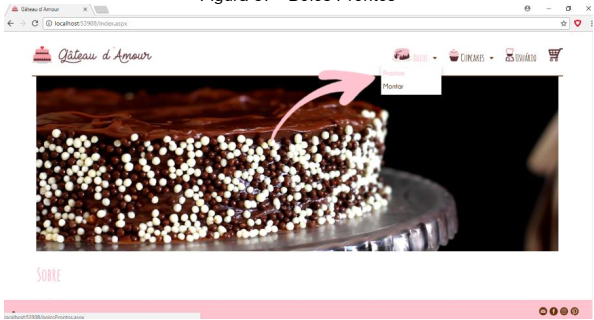
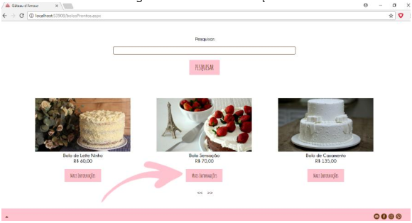
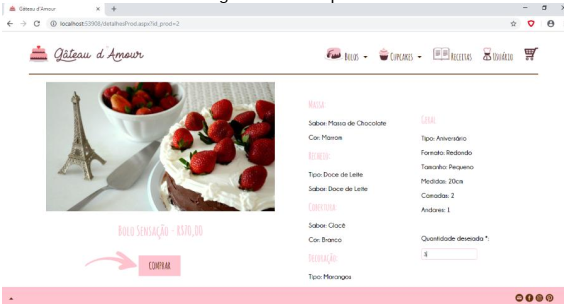
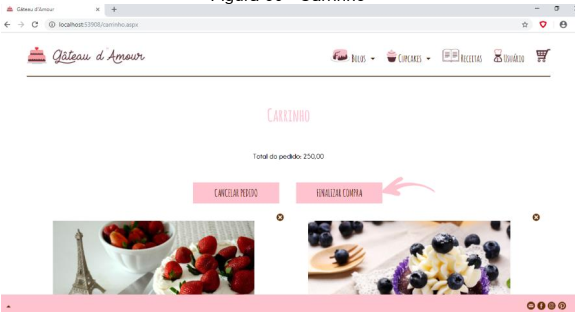

<h1 align="center"></h1>

<h4 align="center"> 
	:heavy_check_mark:  Confeitaria Virtual Gateau D'Amour :heavy_check_mark:
</h4>

## 🔖 Algumas Interfaces 

 &nbsp;&nbsp;&nbsp;&nbsp;&nbsp;&nbsp;
 &nbsp;&nbsp;&nbsp;&nbsp;&nbsp;&nbsp;

 
 &nbsp;&nbsp;&nbsp;&nbsp;&nbsp;&nbsp;
  &nbsp;&nbsp;&nbsp;&nbsp;&nbsp;&nbsp;   

## 💻 Projeto

    Gâteau d’ Amour é uma confeitaria virtual cujo site possibilita a encomenda de
bolos ou cupcakes, escolhendo dentre modelos pré-cadastrados ou montando seu
próprio, selecionando fatores como a massa, recheio, cobertura, decoração, cor e
tamanho. Foi criada uma vez que existe uma escassez nesse mercado, tornando um
desafio para o consumidor encontrar confeitarias onlines que realizam a entrega do
produto com qualidade e pontualidade, com tudo que o cliente deseja, nos mínimos
detalhes. Além de possuir um aplicativo Android que disponibiliza a vitrine da
confeitaria e as avaliações de todos os produtos feitas por usuários cadastrados,
tudo isso através de um smartphone. Apesar de já possuir uma loja física, a Gâteau
d’ Amour quis expandir ainda mais seu alcance, desenvolvendo uma plataforma
online e solucionando outra problemática ao se responsabilizar pela entrega do
pedido, no local que o cliente desejar.

  <a href="#Tecnologias">Tecnologias</a>&nbsp;&nbsp;&nbsp;|&nbsp;&nbsp;&nbsp;
    <a href="#Metodologias">Metodologias</a>&nbsp;&nbsp;&nbsp;|&nbsp;&nbsp;&nbsp;
  <a href="#information_source-como-usar">Como Usar</a>&nbsp;&nbsp;&nbsp;|&nbsp;&nbsp;&nbsp;
  <a href="#memo-licença">Licença</a>

## :Tecnologias

Este projeto foi desenvolvido com  as seguintes tecnologias:

- [Asp.NET](https://dotnet.microsoft.com/apps/aspnet)
- [CSharp](https://docs.microsoft.com/pt-br/dotnet/csharp/)
- [JavaScript](https://developer.mozilla.org/pt-BR/docs/Web/JavaScript)
- [HTML5](https://devdocs.io/html/) 
- [CSS3](https://devdocs.io/css/)
- [BootStrap](https://www.w3schools.com/bootstrap/default.asp)
- [Java](https://docs.oracle.com/en/java/)
- [MySQL](https://dev.mysql.com/doc/refman/8.0/en/sql-syntax-data-definition.html)

## :Softwares

Os seguintes softwares foram utilizados neste projeto:

- [Visual Studio 2013](https://visualstudio.microsoft.com/pt-br/) 
- [Android Studio](https://developer.android.com/studio)
- [Adobe](https://www.adobe.com/pt/creativecloud.html)
- [Figma](https://www.figma.com/)

## :Metodologias

Artigos que estou a publicar no Medium que explica resumidamente cada metodologia utilizada :

- [Design UX](#) 
- [Design Sprint](#)
- [Design UI](#)
- [Scrum](#)

## :information_source: Como Usar

Para executar essa aplicação você vai precisar de Visual Studio 2017, MySQL Server 5.5 and Android Studio 3.5 e o banco de dados do projeto para carregar os inserts do mesmo.

## :memo: Licença
Este projeto está sob licença MIT. Veja a [LICENSE] para mais informações.

---

Feito com ♥ && 🎧 && 😊 || 😥 
 por Adilson Oliveira :wave: [Get in touch!] www.linkedin.com/in/adilson-p-oliveira

